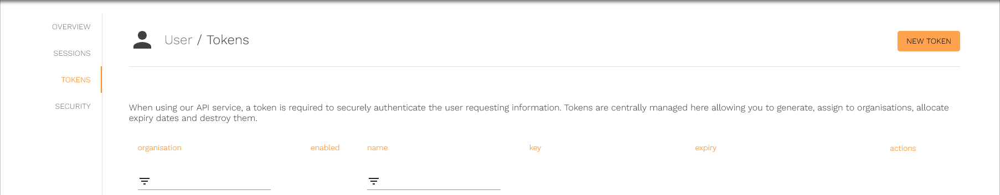

# Creating a Fingoti API key








1. [Go to the Tokens page](https://account.fingoti.com/user/tokens)

   

2. Press New Token (at the top-right &nearr; of the page)

   

3. Give the token a name

   

4. Select an Organisation

   

5. Set the time and date for the token to expire

   

   

6. Press Create Token

   
