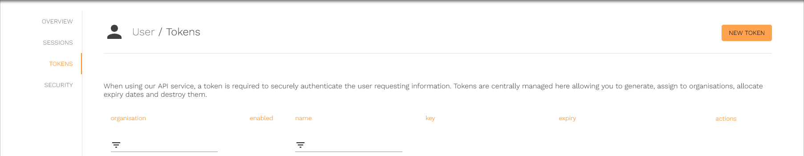
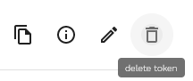
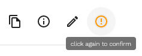
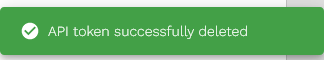

# Deleting a Fingoti API key








1.  [Go to the Tokens page](https://account.fingoti.com/user/tokens)

    

2.  Press Delete Token

    

3.  Press again to confirm deletion

    

    The API key has now been deleted, and can no longer be used.

    
