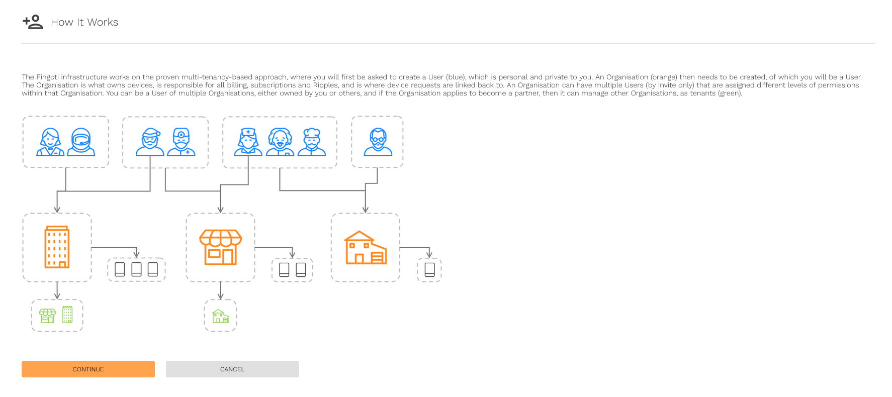
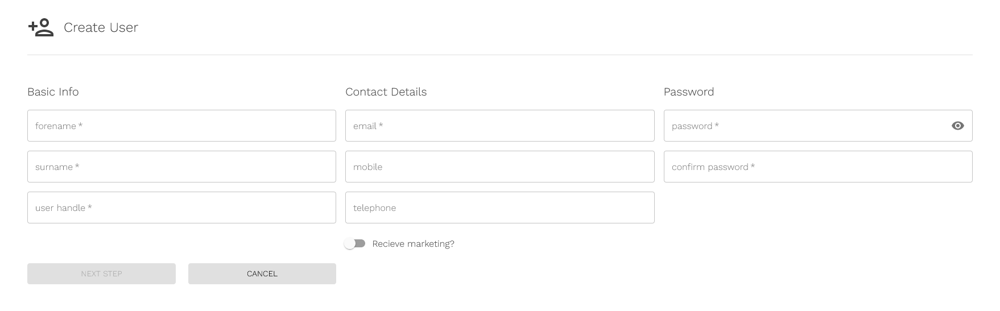
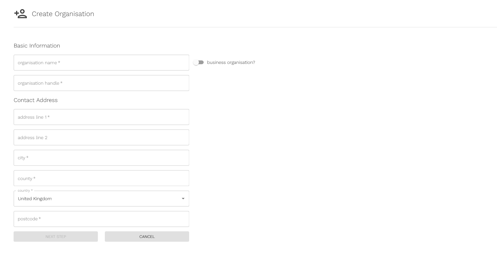
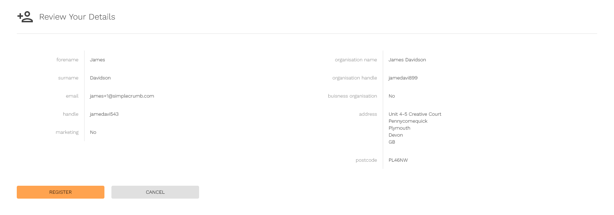
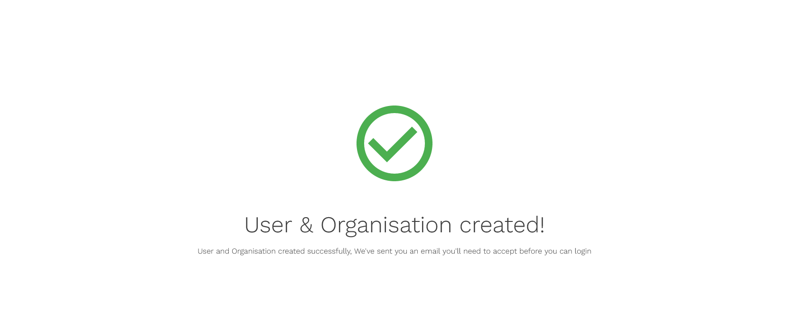
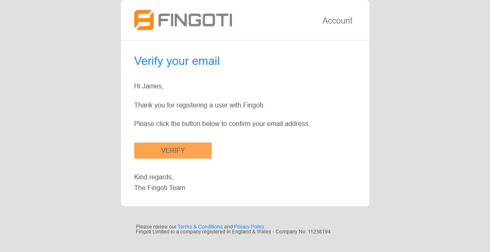

# Creating a Fingoti Cloud account


None.



Get 1,000 free Ripples when you sign up today!



The Fingoti Cloud is required to claim Fingoti devices.


1. [Go to the registration page](https://account.fingoti.com/register)

   

   <!-- TODO Link to the org creation page -->

   
   If you are already logged in, you will be prompted to [create a new Organisation](/) instead.
   

   1. Press Continue

      

2. Enter your personal information

   <!-- TODO Use an image tag for captions -->

   

   Required fields are denoted by an asterisk `*`. Namely, providing a phone number is optional.

   
   Passwords must be at least six characters long, have at least one uppercase letter, one number, and one symbol.
   

   1. Press Next Step

      

<!-- FIXME Only if the user wasn't invited via email -->

3. Enter information about your Organisation

   
   
   Personal Organisations are subject to Personal pricing, and are liable to pay value-added tax (VAT).
   
   
   Business Organisations are subject to Business pricing, and are exempt from paying value-added tax (VAT).
   
   

   

   1. Press Next Step

   

4. Ensure the details are correct before proceeding

   

   1. Press Register

      

      The user and organisation have now been created.

      

5. Press Verify to verify your email address

   
