# Amending Fingoti account information

## Overview

Amend your name and telephone numbers, and choose to subscribe to marketing emails.


You currently cannot change the email address associated with your Fingoti Cloud account.


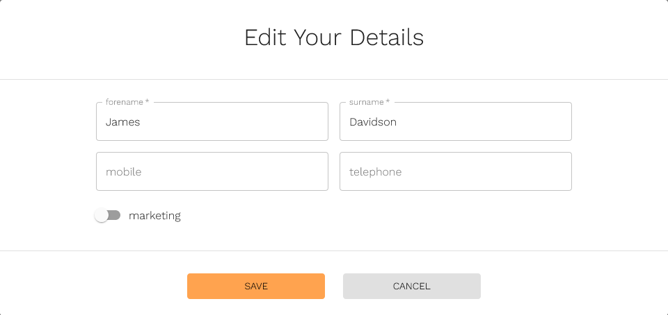

[Go to the Overview page](https://account.fingoti.com/user).

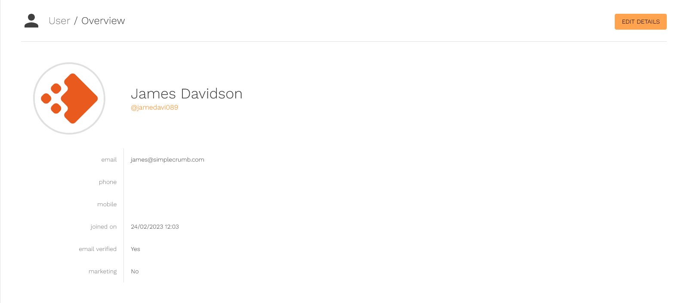

<!-- Does Markdoc support HTML entities? -->

Then press Edit Details (in the top-right of the page &nearr;).

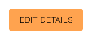

## Sessions

Close sessions individually or altogether, and see session details (such as operating system, browser version, geolocation, date and time).

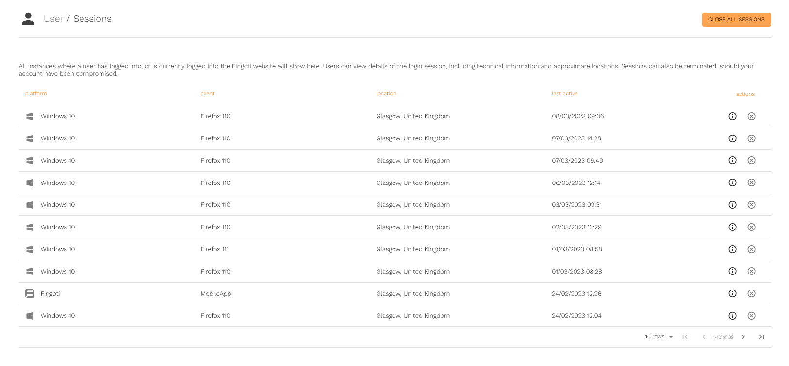

First, [go to the Sessions page](https://account.fingoti.com/user/sessions).

You can close all sessions by pressing the button in the top-right &nearr; of the page.

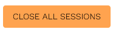

Or end an individual session, by pressing the button to the right &rarr; of the row.

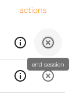

Alternatively, view session details, by pressing the button to the right &rarr; of the row.

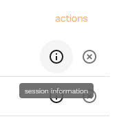

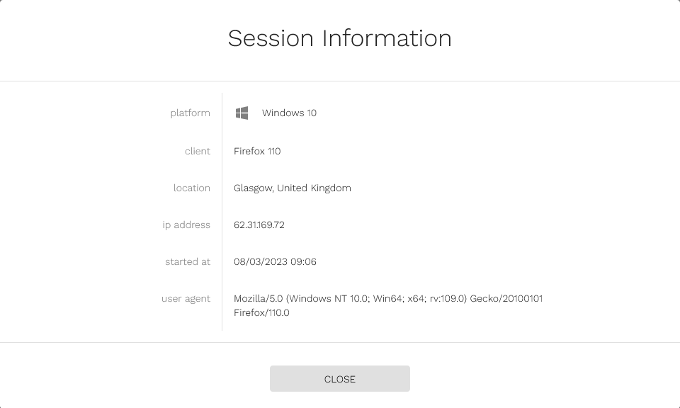

## Tokens

Tokens are covered in upcoming documentation.

## Security

Change your password, or enable multi-factor authentication.

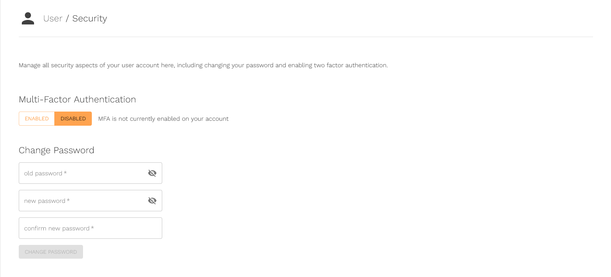

Multi-factor authentication is covered in upcoming documentation.


Resetting your password is done separately from the Security page, and is covered in upcoming documentation.


[Go to the Security page](https://account.fingoti.com/user/security).

- Enter your existing password
- Enter the new password twice
- Press Change Password

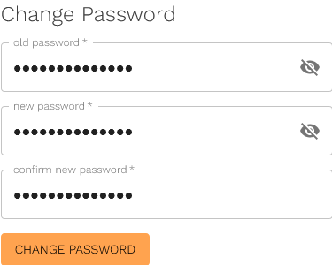

The new password will now be in effect.

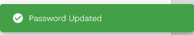
