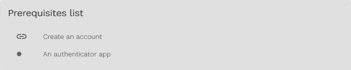

Welcome to the documentation for everything Fingoti.

Our tutorials can be read one at a time, or from beginning to end. We provide a prerequisites list for each guide. For example, [Enable multi-factor authentication](1-Account-management/Enable-multi-factor-authentication.md).

This menu outlines actions that must be taken before reading the current page, in this case:

- Creating an account
- Installing an authenticator app

## Feedback

If you would like to suggest the documentation we should write next, or to offer feedback on existing documentation, please [send us an email](mailto:support@fingoti.com).

## GitHub

Our documentation repository is publicly available on GitHub. If you are viewing `README.md` on GitHub, please go to <https://documentation.fingoti.com/documentation>.